# 뉴스 요약 자동화 시스템

## 1. 프로젝트 개요

본 프로젝트는 Google News RSS에서 최신 뉴스를 자동으로 수집하고, 사전에 정의한 AI 관련 키워드를 기준으로 필요한 기사만 선별한 뒤 Google Gemini AI로 핵심 내용을 요약하는 자동화 시스템입니다.

요약된 뉴스는 노션 데이터베이스에 자동 저장되며, 저장이 완료된 결과는 Discord 채널로 전송됩니다. 또한 RSS에서 제공하는 GUID를 기준으로 동일한 기사가 이미 저장되어 있는지 확인하여, 중복 저장과 불필요한 Gemini 호출이 발생하지 않도록 구성했습니다.

본 프로젝트는 코드 작성 없이 Make를 이용해 데이터 수집, 필터링, 중복 확인, AI 가공, 데이터 저장, 알림 전송으로 이어지는 전체 자동화 워크플로우를 구현하는 것을 목표로 했습니다.

---

## 2. 프로젝트 목표

- Google News RSS를 통한 최신 뉴스 자동 수집
- AI 관련 키워드를 이용한 주제 필터링
- Google Gemini AI를 이용한 뉴스 요약 자동화
- 노션 데이터베이스 자동 저장
- 뉴스 출처와 GUID 자동 저장
- GUID 기반 중복 뉴스 저장 방지
- Discord 채널을 통한 결과 자동 알림
- 사람의 개입 없이 실행되는 자동화 파이프라인 구축

---

## 3. 사용 기술

| 구분 | 사용 도구 | 역할 |
| --- | --- | --- |
| 자동화 | Make | 전체 워크플로우 구성 및 실행 |
| 뉴스 수집 | Google News RSS | 다양한 언론사의 최신 뉴스 수집 |
| AI 가공 | Google Gemini AI | 뉴스 핵심 내용 요약 |
| 데이터 저장 | 노션 Database | 뉴스 제목, 요약, 링크, 발행일, 출처, GUID 저장 |
| 알림 | Discord | 요약 결과를 채널로 자동 전송 |
| 협업 및 문서 관리 | GitHub | README와 프로젝트 자료 관리 |

---

## 4. 전체 시스템 구성

```
Make Scheduler
      │
      ▼
Google News RSS
      │
      ▼
AI Keyword Filter
      │
      ▼
노션 Search Objects
(GUID 중복 검색)
      │
      ▼
Duplicate Filter
(검색 결과 0건만 통과)
      │
      ▼
Google Gemini AI
(요약 및 감성 분석)
      │
      ▼
Parse JSON
(summary / sentiment 분리)
      │
      ▼
노션 Database 저장
      │
      ▼
Discord 알림 전송
```

### 캡처 1. Make 전체 워크플로우

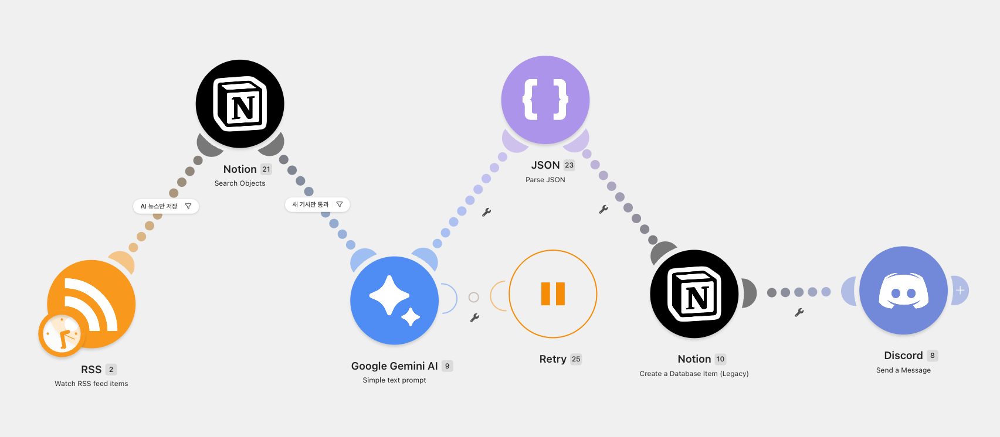

---

## 5. 단계별 워크플로우 설명

### 5.1 Scheduler

Make의 Scheduler를 이용하여 설정한 주기에 맞춰 시나리오가 자동 실행되도록 구성했습니다. 사용자가 직접 실행하지 않아도 설정된 주기에 따라 뉴스 수집 작업이 시작됩니다.

본 프로젝트에서는 아래와 같이 설정했습니다.

- 실행 주기: `Every day`
- 실행 시간: `09:00`
- 타임존: `Asia/Seoul`

### 캡처 2. Scheduler 설정

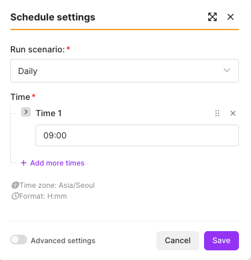

### 캡처 3. Scheduler 실행 이력

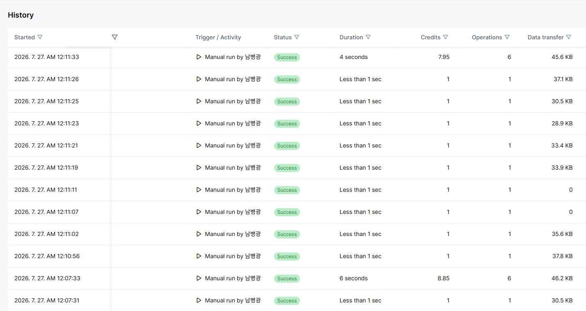

---

### 5.2 Google News RSS 수집

Google News RSS를 이용하여 다양한 언론사의 최신 뉴스를 자동으로 수집하도록 구성했습니다.

```
https://news.google.com/rss?hl=ko&gl=KR&ceid=KR:ko
```

Google News RSS는 다양한 언론사의 최신 뉴스를 한 번에 수집할 수 있다는 장점이 있습니다. 수집된 뉴스의 발행 언론사를 구분하고 관리할 수 있도록 노션 데이터베이스에 `출처` 필드를 구성했습니다.

또한 RSS 모듈의 Maximum number of returned items를 30으로 설정하여 하루 1회 실행 시 최신 뉴스를 충분히 수집한 후, AI 키워드 필터를 통해 프로젝트와 관련된 기사만 선별하도록 구성했습니다.

### 캡처 4. Google News RSS 설정

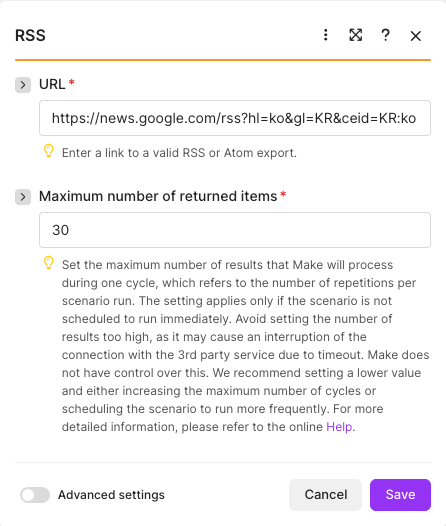

RSS에서 활용한 주요 데이터는 다음과 같습니다.

- 뉴스 제목
- 뉴스 링크
- 발행일
- 뉴스 출처
- GUID
- RSS에서 제공하는 기사 설명 데이터

RSS 모듈 실행 결과, 기사 제목(title), 링크(link), 발행일(pubDate), 출처(source), GUID 등의 정보가 정상적으로 수집되는 것을 확인했습니다.

### 캡처 5. RSS 수집 결과

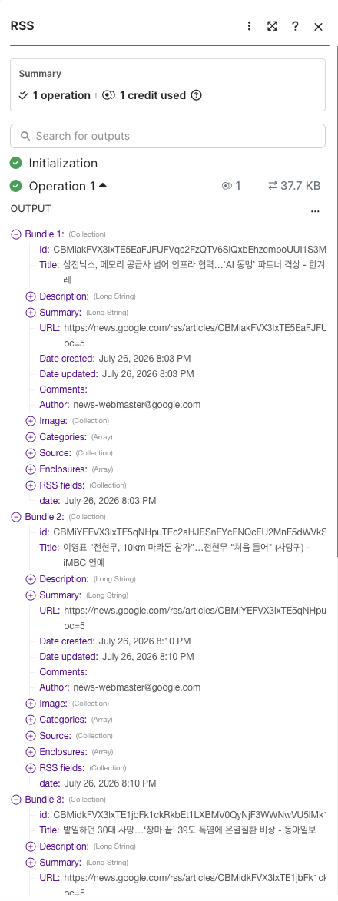

---

### 5.3 AI 관련 뉴스 필터링

RSS에서 수집되는 모든 뉴스를 요약하지 않고, 프로젝트 주제인 AI와 관련된 뉴스만 다음 단계로 전달하도록 필터를 구성했습니다.

#### 필터링 기준

제목 또는 기사 데이터에 AI 관련 키워드가 포함된 경우에만 통과시킵니다.

필터링 키워드:

- AI
- 인공지능
- 생성형 AI
- LLM
- ChatGPT
- Gemini
- OpenAI
- Claude
- 머신러닝


#### 선택 이유

- 프로젝트 주제와 관련된 기사만 선별하기 위해
- 불필요한 Gemini API 호출을 줄이기 위해
- 노션 데이터베이스에 저장되는 뉴스의 품질과 일관성을 유지하기 위해
- Discord에 불필요한 알림이 반복되는 것을 방지하기 위해

#### 키워드 관리 정책

프로젝트에서 사용하는 키워드는 AI 관련 주제를 일관되게 선별하기 위해 관리합니다. 새로운 AI 기술이나 서비스가 등장하면 키워드를 추가하고, 사용 빈도가 낮거나 프로젝트 목적과 맞지 않는 키워드는 검토 후 수정합니다. 키워드 변경 시에는 README와 Make 시나리오를 함께 업데이트하여 동일한 조건으로 재현 가능한 필터링이 이루어지도록 관리합니다.

### 캡처 6. 키워드 필터 설정


---

### 5.4 GUID 기반 중복 저장 방지

동일한 RSS 기사가 시나리오 실행 때마다 반복 처리되지 않도록 RSS에서 제공하는 GUID를 중복 확인 키로 사용했습니다.

중복 방지는 하나의 노션 데이터베이스를 두 개의 Make 모듈이 함께 사용하는 방식으로 구현했습니다.

1. `노션 Search Objects` 모듈이 노션 데이터베이스에서 동일한 GUID가 존재하는지 검색합니다.
2. 검색 결과가 0건인 경우에만 다음 단계로 이동합니다.
3. 검색 결과가 존재하면 이미 처리된 기사이므로 Gemini 요약, 노션 저장, Discord 전송을 실행하지 않습니다.
4. 신규 기사가 저장될 때 RSS의 GUID도 같은 노션 데이터베이스에 함께 저장합니다.

#### Search Objects 설정

```
Object Type: Data Source Items
Property: GUID
Operator: Equals
Value: RSS의 GUID
Limit: 1
```

#### 중복 필터 설정

```
Total number of bundles
Equal to
0
```

#### GUID 선택 이유

중복 확인 키로 RSS의 GUID를 사용한 이유는 기사마다 고유하게 제공되는 식별자이기 때문입니다. 링크(URL)는 추적 파라미터나 주소 형식이 변경될 수 있지만, GUID는 동일한 기사를 안정적으로 식별할 수 있어 중복 판별의 정확성과 재현성을 높일 수 있습니다.

#### 적용 효과

- 동일 뉴스의 중복 저장 방지
- 기사 1건당 Gemini 요약 호출 1회 유지
- 불필요한 API 사용량 감소
- 노션 데이터베이스의 데이터 정합성 유지
- 중복 Discord 알림 방지

### 캡처 7. GUID 검색 설정

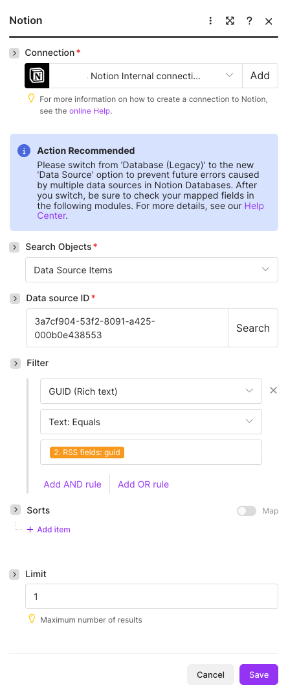

### 캡처 8. 중복 통과 필터


---

### 5.5 Google Gemini AI 뉴스 요약

중복 확인을 통과한 신규 기사만 Google Gemini AI에 전달합니다. Gemini는 전달받은 뉴스 내용을 바탕으로 핵심 내용을 요약하고, 뉴스의 전반적인 감성을 분석하여 JSON 형태로 반환합니다.

#### 요약 기준

- 뉴스 핵심 내용을 3줄 이내로 요약
- 뉴스 감성을 **긍정**, **중립**, **부정** 중 하나로 분류
- JSON 형식으로 결과 반환
- 이후 Parse JSON 모듈에서 Summary와 Sentiment를 각각 분리하여 Notion과 Discord에서 활용

#### 프롬프트 예시

```
다음 뉴스를 분석해 주세요.

1. 뉴스 핵심 내용을 3줄 이내로 요약하세요.
2. 감성을 긍정, 중립, 부정 중 하나로 분류하세요.
3. 반드시 아래 JSON 형식으로만 출력하세요.
4. ```json 같은 코드 블록은 사용하지 마세요.
5. JSON 앞뒤에 설명을 추가하지 마세요.
{
  "summary": "뉴스 요약",
  "sentiment": "<긍정|중립|부정>"
}

제목:{{2.rssFields.title}}
내용:{{2.rssFields.description}}
```

### 캡처 9. Gemini 프롬프트

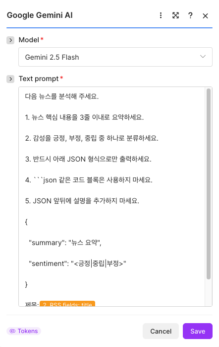

---

### 5.6 Parse JSON 데이터 분리

Google Gemini AI는 뉴스 요약과 감성 분석 결과를 JSON 형식의 문자열로 반환하도록 구성했습니다. 반환된 데이터를 노션 데이터베이스와 Discord 메시지에서 각각 활용하기 위해 Parse JSON 모듈을 사용하여 데이터를 분리했습니다.

Gemini AI가 반환하는 JSON 형식은 다음과 같습니다.

```json
{

  "summary": "뉴스 핵심 요약",

  "sentiment": "긍정"

}
```

Parse JSON 모듈에서는 Gemini AI의 출력 결과를 입력값으로 받아 다음 두 항목으로 분리합니다.

- `summary` : 뉴스 핵심 요약
- `sentiment` : 감성 분석 결과(긍정 / 중립 / 부정)

분리된 데이터는 이후 노션 데이터베이스의 **요약** 및 **감성** 속성에 저장하고, Discord 메시지에도 각각 매핑하여 활용하도록 구성했습니다.

Parse JSON 모듈을 사용하지 않을 경우 Gemini AI의 반환값 전체가 하나의 문자열로 저장되므로, 필요한 항목을 개별적으로 활용하기 어렵습니다. 따라서 요약과 감성 분석 결과를 각각 사용할 수 있도록 Parse JSON 단계를 추가했습니다.

### 캡처 10. Parse JSON 설정

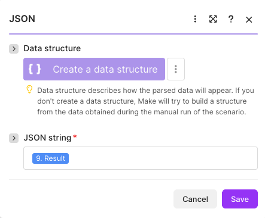

### **5.7 노션 데이터베이스 저장**

Google Gemini AI가 생성한 **뉴스 요약**과 **감성 분석 결과**, 그리고 RSS에서 수집한 뉴스 정보를 하나의 Notion 데이터베이스에 저장합니다.

#### **노션 데이터베이스 속성**

| **필드명** | **속성 타입** | **저장 데이터** |
| --- | --- | --- |
| 제목 | Title | RSS 뉴스 제목 |
| 요약 | Text | Gemini가 생성한 뉴스 요약 |
| 감성 | Select | Gemini가 분석한 감성(긍정 / 중립 / 부정) |
| 링크 | URL | 뉴스 원문 링크 |
| 발행일 | Date | RSS 발행 일시 |
| 출처 | Text | Google News RSS에 포함된 언론사 정보 |
| GUID | Text | 중복 확인에 사용하는 RSS 고유 식별자 |

Google News RSS에서 제공하는 언론사 정보를 활용하기 위해 **출처** 필드를 구성하였으며, 다양한 언론사의 뉴스를 한눈에 확인할 수 있도록 하였습니다.

또한 Gemini AI의 감성 분석 결과를 **감성(Select)** 속성에 저장하여 뉴스의 전반적인 분위기를 쉽게 파악할 수 있도록 구성했습니다.

`GUID` 필드는 동일 기사의 저장 여부를 확인하고 신규 기사를 판별하는 용도로 사용합니다.

### 캡처 11. 노션 데이터베이스 구조

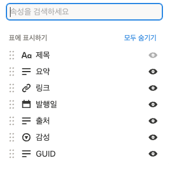

### 캡처 12. 노션 저장 결과

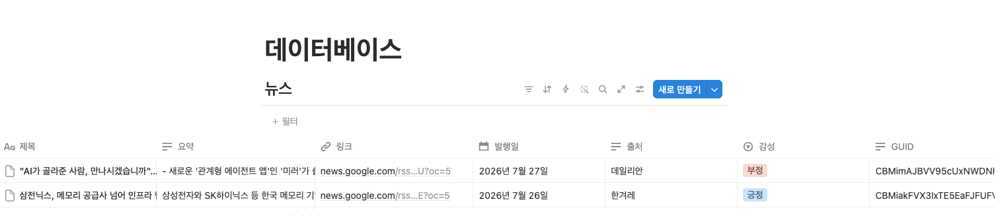

---

### 5.8 Discord 자동 알림

노션 데이터베이스 저장이 완료된 신규 뉴스는 Discord Send a Message를 통해 지정된 Discord 채널로 자동 전송되도록 구성했습니다.

Discord 모듈에서는 Parse JSON 모듈에서 분리한 뉴스 요약과 감성 분석 결과, 그리고 RSS에서 수집한 뉴스 정보를 매핑하여 메시지를 생성하도록 설정했습니다.

Discord 메시지에는 다음 정보를 포함하도록 구성했습니다.

- 뉴스 제목
- Gemini AI 뉴스 요약
- 감성 분석 결과(긍정 / 중립 / 부정)
- 뉴스 출처
- 발행일
- 원문 링크

이를 통해 팀원이 노션 데이터베이스를 직접 열지 않아도 Discord 채널에서 새로운 뉴스와 AI 요약, 감성 분석 결과를 실시간으로 확인할 수 있도록 구성했습니다.

### 캡처 13. Discord 모듈 설정

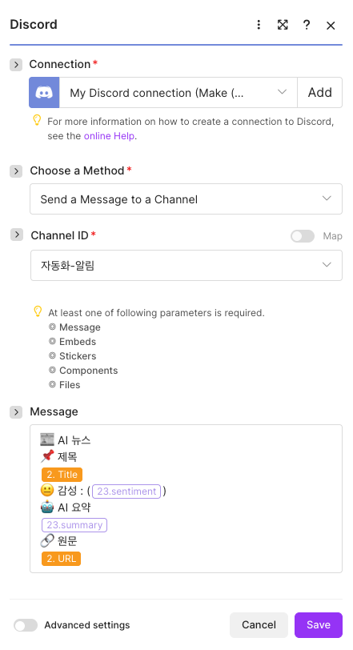

### 캡처 14. Discord 전송 결과

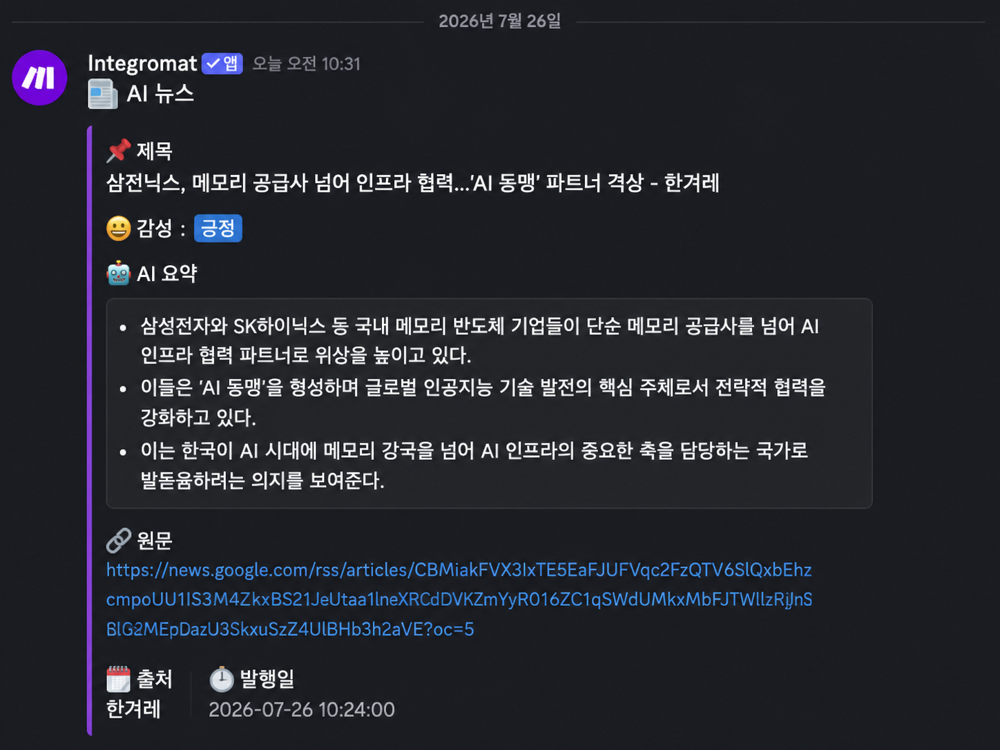

---

## 6. 에러 처리 및 안정성 정책

본 시스템은 사람의 개입 없이 실행되는 자동화 구조를 목표로 다음과 같은 처리 정책을 적용했습니다.

| 상황 | 처리 방식 | 적용 이유 |
| --- | --- | --- |
| RSS 수집 결과가 없는 경우 | 이후 모듈이 실행되지 않고 다음 Scheduler 실행을 대기 | 빈 데이터 저장과 불필요한 API 호출 방지 |
| AI 키워드 조건을 만족하지 않는 경우 | 필터에서 처리를 종료 | 프로젝트 주제와 무관한 뉴스 제외 |
| 동일 GUID가 이미 존재하는 경우 | Gemini, 노션 저장, Discord 전송을 실행하지 않음 | 중복 저장과 중복 알림 및 AI 호출 방지 |
| Gemini 또는 외부 서비스 오류 | Make 실행 이력에서 오류 모듈과 데이터를 확인하고 재실행 | 오류 위치를 추적하고 안정적으로 복구 |
| API 키 및 토큰 | Make Connection을 통해 비공개 관리 | 문서와 화면에서 인증정보 노출 방지 |

#### 운영 정책

- 오류가 발생한 경우 Make 실행 이력(History)을 통해 오류 원인을 확인합니다.
- 오류 원인을 확인한 후 필요한 경우 해당 시나리오를 다시 실행합니다.
- 정상 처리되지 않은 실행은 다음 Scheduler 실행과 별도로 확인하여 관리합니다.

---

## 7. 테스트 결과

전체 워크플로우를 완성한 후 신규 기사와 중복 기사를 대상으로 테스트를 진행했습니다.

| 테스트 항목 | 예상 결과 | 테스트 결과 |
| --- | --- | --- |
| Google News RSS 수집 | 최신 뉴스가 정상 수집됨 | 정상 |
| AI 키워드 필터 | AI 관련 기사만 통과함 | 정상 |
| GUID 신규 기사 검색 | 검색 결과 0건일 때 다음 단계 실행 | 정상 |
| GUID 중복 기사 검색 | 기존 GUID가 있으면 처리 중단 | 정상 |
| Gemini 요약 | 뉴스 핵심 내용이 3줄 이내로 생성됨 | 정상 |
| Parse JSON 분리 | `summary`와 `sentiment`가 정상적으로 분리됨 | 정상 |
| 감성 저장 | 노션 `Select` 속성에 감성(긍정 / 중립 / 부정)이 정상 저장됨 | 정상 |
| 노션 저장 | 각 데이터가 올바른 속성에 저장됨 | 정상 |
| 출처 저장 | 언론사 정보가 출처 필드에 저장됨 | 정상 |
| Discord 전송 | 신규 뉴스 요약이 채널로 전송됨 | 정상 |
| 전체 자동 실행 | 사람의 개입 없이 전체 과정 완료 | 정상 |

### 종합 결과

Make를 이용하여 Google News RSS 수집부터 AI 키워드 필터링, GUID 기반 중복 확인, Gemini AI 뉴스 요약, Parse JSON 데이터 분리, 노션 데이터베이스 저장, Discord 자동 알림까지 전체 자동화 워크플로우를 성공적으로 구현했습니다.

- Google News RSS 뉴스 수집
- AI 관련 뉴스 필터링
- GUID 기반 중복 저장 방지
- Gemini AI 뉴스 요약 및 감성 분석
- Parse JSON을 이용한 요약·감성 데이터 분리
- 노션 데이터베이스 저장
- 출처 및 GUID 저장
- Discord 자동 알림

---

## 8. 프로젝트 핵심 구현 내용

본 프로젝트에서는 Google News RSS를 이용한 뉴스 수집부터 AI 기반 뉴스 요약, 노션 데이터베이스 저장, Discord 알림까지 자동화된 뉴스 처리 시스템을 구현했습니다.
구현한 주요 기능은 다음과 같습니다.

| **기능** | **구현 내용** |
| --- | --- |
| 뉴스 수집 | Google News RSS를 이용하여 최신 뉴스를 자동 수집 |
| 뉴스 필터링 | AI 관련 키워드를 기준으로 필요한 뉴스만 선별 |
| AI 요약 및 감성 분석 | Google Gemini AI를 이용하여 뉴스를 3줄 이내로 요약하고 감성을 분석 |
| 데이터 변환 | Parse JSON을 이용하여 요약문과 감성 분석 결과를 분리 |
| 중복 처리 | GUID를 이용하여 동일 뉴스의 중복 저장 방지 |
| 데이터 저장 | 노션 Database에 제목, 요약, 감성, 링크, 발행일, 출처, GUID 자동 저장 |
| 알림 | Discord Send a Message 모듈을 이용하여 요약 및 감성 분석 결과를 자동 전송 |

### **핵심 특징**

- Google News RSS를 활용하여 다양한 언론사의 최신 뉴스를 자동 수집
- AI 관련 키워드를 이용한 뉴스 자동 필터링
- Google Gemini AI를 활용한 뉴스 요약 및 감성 분석 자동화
- Parse JSON을 이용한 AI 응답 데이터의 자동 분리 및 활용
- GUID 기반 중복 저장 방지로 불필요한 AI 호출과 데이터 중복 최소화
- 노션 Database를 활용한 체계적인 뉴스 데이터 관리
- Discord를 통한 실시간 뉴스 요약 및 감성 분석 결과 제공

---

## 9. 팀 구성 및 역할

| 이름 | 역할 | 담당 업무 |
| --- | --- | --- |
| 남병광 | PM / 조장 | 프로젝트 일정 및 업무 조율, 전체 워크플로우 검토, GitHub 저장소 관리 및 최종 README 작성 |
| 정가영 | 기획 | 프로젝트 목적 및 요구사항 분석, 기능 구성 및 문서 기획 |
| 곽승렬 | 시스템 설계 | 자동화 워크플로우 설계 및 모듈 연결 구조 설계 |
| 정형경 | 구현 | Make 모듈 구성, 데이터 매핑, 자동화 기능 구현 |
| 심동석 | 테스트 및 문서화 | 기능 테스트, 시나리오 검증, README 작성 지원 및 피드백 |

### 협업 과정

프로젝트 진행 중 팀원들은 구현 결과를 공유하고 상호 피드백을 통해 워크플로우와 문서를 개선했습니다.

주요 피드백 및 반영 내용은 다음과 같습니다.

- Gemini AI의 응답을 Parse JSON 모듈로 구조화하여 요약(summary)과 감성(sentiment) 데이터를 안정적으로 추출하도록 개선했습니다.
- Discord 및 노션에 Gemini의 원본 JSON(Result)을 직접 연결할 경우 JSON 문자열이 그대로 출력되는 문제를 확인하고, Parse JSON의 `summary`와 `sentiment` 값을 사용하도록 수정하여 출력 형식을 개선했습니다.
- 노션 데이터베이스에 감성 태그를 추가하고, 제목, 요약, 링크, 출처, 발행일과 함께 자동 저장되도록 데이터 매핑을 보완했습니다.
- Discord 알림 메시지가 JSON 형식이 아닌 읽기 쉬운 텍스트 형태로 표시되도록 메시지 템플릿을 수정했습니다.
- 구현 결과를 팀원 간에 공유하며 노션 저장 결과와 Discord 출력 결과를 함께 검증하고, README에 해당 내용을 반영했습니다.

이와 같은 피드백을 반영하여 워크플로우의 완성도를 높였으며, 최종적으로 전체 자동화 프로세스가 정상적으로 동작하는 것을 확인했습니다.

---

## 10. 프로젝트 산출물

본 프로젝트의 최종 산출물은 다음과 같습니다.

1. Make 뉴스 요약 자동화 워크플로우
2. AI 요약 및 감성 분석 결과가 저장된 노션 데이터베이스
3. 프로젝트 README
    - 워크플로우 구조 및 단계별 설명
    - 주제 필터링 기준
    - GUID 기반 중복 처리 방식
    - 에러 처리 및 안정성 정책
    - 테스트 결과

---

## 11. 프로젝트 폴더 구조

```
.
├── README.md
├── docs
│   ├── GUIDE.md
│   └── BONUS.md
└── images
    ├── make_workflow.png
    ├── scheduler.png
    ├── keyword_filter.png
    ├── scheduler_history.png
    ├── guid_search.png
    ├── rss_setting.png
    ├── duplicate_filter.png
    ├── rss_output.png
    ├── gemini_prompt.png
    ├── parse_json.png
    ├── notion_database_fields.png
    ├── notion_result.png
    ├── discord_module.png
    └── discord_result.png
```

- `README.md` : 프로젝트 전체 설명 및 구현 과정
- `docs/GUIDE.md` : 프로젝트 변경 사항 및 적용 가이드
- `docs/BONUS.md` : 보너스 과제(AI 뉴스 감성 분석 기능) 구현 내용
- `images/` : README에서 사용하는 캡처 이미지

이미지 파일은 README와 같은 저장소의 `images` 폴더에 저장하고 다음과 같은 Markdown 문법으로 표시합니다.

```markdown

```

---

## 12. 보안 유의 사항

- API 키와 토큰을 README 또는 공개 저장소에 입력하지 않습니다.
- Make Connection을 이용하여 인증 정보를 관리합니다.
- 캡처 화면에 API 키, Connection 정보, 노션 토큰 등 민감한 정보가 보이지 않도록 마스킹합니다.
- Discord 채널 및 인증 정보가 외부에 노출되지 않도록 관리합니다.
- 노션 페이지 공유 범위와 데이터베이스 권한을 제출 전에 확인합니다.

---

## 13. 향후 개선 사항

- 사용자 지정 키워드 관리 기능 추가
- 뉴스 분야별 자동 카테고리 분류
- Gemini 프롬프트 고도화를 통한 요약 품질 향상
- AI 기반 뉴스 감성 분석 기능 고도화
- 뉴스 내용에 맞는 썸네일 이미지 자동 생성
- 이메일, Slack 등 다양한 협업 도구로 알림 채널 확장
- 처리 성공 및 실패 건수를 확인할 수 있는 모니터링 대시보드 추가

---

## 14. 결론

본 프로젝트에서는 Make를 중심으로 Google News RSS, Google Gemini AI, 노션, Discord를 연동하여 뉴스 수집부터 AI 요약 및 감성 분석, 저장, 알림까지 자동으로 처리되는 워크플로우를 구현했습니다.

Google News RSS를 활용하여 다양한 언론사의 최신 뉴스를 수집하고, AI 관련 키워드 필터를 통해 프로젝트 주제에 적합한 기사만 선별하도록 구성했습니다. 또한 Google Gemini AI를 이용해 뉴스 요약과 감성 분석을 수행하고, Parse JSON 모듈을 통해 결과를 구조화한 후 노션 데이터베이스에 제목, 요약, 감성, 링크, 발행일, 출처, GUID를 저장했습니다. GUID 기반 중복 확인 로직을 적용하여 동일 뉴스의 반복 저장과 불필요한 Gemini 호출을 방지했습니다.

전체 기능 구현 후 실행 테스트를 진행한 결과, 뉴스 수집, 키워드 필터링, 중복 확인, AI 요약 및 감성 분석, 노션 저장, Discord 알림 전송이 모두 정상적으로 동작하는 것을 확인했습니다. 이를 통해 데이터 수집부터 AI 가공, 저장, 알림까지 사람의 개입 없이 자동으로 수행되는 뉴스 요약 시스템을 완성했으며, Make를 활용한 업무 자동화와 AI 서비스 연계 방법을 실습하고 활용하는 경험을 얻을 수 있었습니다.
