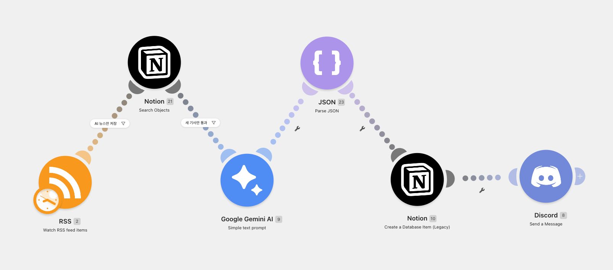
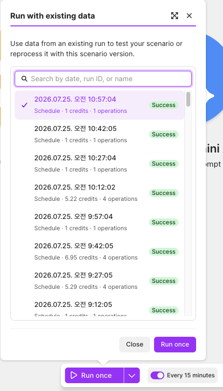
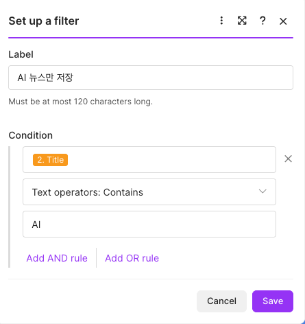
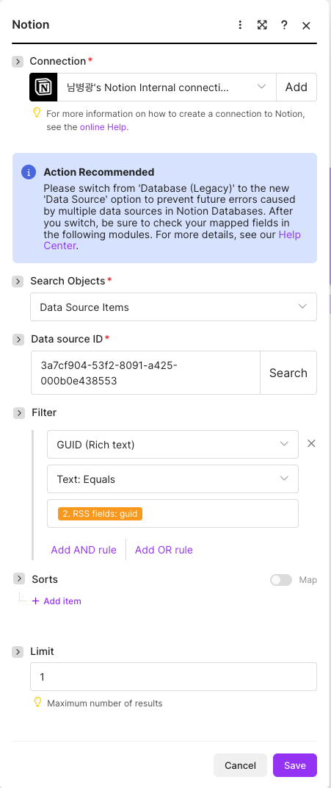
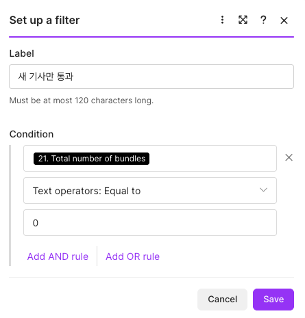

# 뉴스 요약 자동화 시스템

## 1. 프로젝트 개요

본 프로젝트는 Google News RSS에서 최신 뉴스를 자동으로 수집하고, 사전에 정의한 AI 관련 키워드를 기준으로 필요한 기사만 선별한 뒤 Google Gemini AI로 핵심 내용을 요약하는 자동화 시스템입니다.

요약된 뉴스는 노션 데이터베이스에 자동 저장되며, 저장이 완료된 결과는 Discord 채널로 전송됩니다. 또한 RSS에서 제공하는 GUID를 기준으로 동일한 기사가 이미 저장되어 있는지 확인하여, 중복 저장과 불필요한 Gemini 호출이 발생하지 않도록 구성했습니다.

본 프로젝트는 코드 작성 없이 Make를 이용해 데이터 수집, 필터링, 중복 확인, AI 가공, 데이터 저장, 알림 전송으로 이어지는 전체 자동화 워크플로우를 구현하는 것을 목표로 했습니다.

---

## 2. 프로젝트 목표

- Google News RSS를 통한 최신 뉴스 자동 수집
- AI 관련 키워드를 이용한 주제 필터링
- Google Gemini AI를 이용한 뉴스 요약 자동화
- 노션 데이터베이스 자동 저장
- 뉴스 출처와 GUID 자동 저장
- GUID 기반 중복 뉴스 저장 방지
- Discord 채널을 통한 결과 자동 알림
- 사람의 개입 없이 실행되는 자동화 파이프라인 구축

---

## 3. 사용 기술

| 구분 | 사용 도구 | 역할 |
|---|---|---|
| 자동화 | Make | 전체 워크플로우 구성 및 실행 |
| 뉴스 수집 | Google News RSS | 다양한 언론사의 최신 뉴스 수집 |
| AI 가공 | Google Gemini AI | 뉴스 핵심 내용 요약 |
| 데이터 저장 | 노션 Database | 뉴스 제목, 요약, 링크, 발행일, 출처, GUID 저장 |
| 알림 | Discord Webhook | 요약 결과를 채널로 자동 전송 |
| 협업 및 문서 관리 | GitHub | README와 프로젝트 자료 관리 |

---

## 4. 전체 시스템 구성

```text
Make Scheduler
      │
      ▼
Google News RSS
      │
      ▼
AI Keyword Filter
      │
      ▼
노션 Search Objects
(GUID 중복 검색)
      │
      ▼
Duplicate Filter
(검색 결과 0건만 통과)
      │
      ▼
Google Gemini AI
      │
      ▼
노션 Database 저장
      │
      ▼
Discord Webhook 전송
```

### 캡처 1. Make 전체 워크플로우

> Google News RSS 수집부터 키워드 필터링, GUID 중복 확인, Gemini 요약, 노션 저장, Discord 전송까지 연결된 Make 시나리오 전체 화면을 캡처합니다. 모듈 이름과 연결 순서가 한 화면에 보이도록 촬영합니다.



---

## 5. 단계별 워크플로우 설명

### 5.1 Scheduler

Make의 Scheduler를 이용하여 설정한 시간 또는 주기에 맞춰 시나리오가 자동 실행되도록 구성했습니다. 사용자가 직접 실행하지 않아도 정해진 일정에 따라 뉴스 수집 작업이 시작됩니다.

> 보고서 제출 전 실제 Make에 설정한 실행 주기 또는 시간을 아래에 입력합니다.
>
> - 실행 주기: `실제 설정값 입력`
> - 시간대: `Asia/Seoul`

### 캡처 2. Scheduler 설정

> Make 시나리오의 실행 주기와 시간대가 보이도록 Scheduler 설정 화면을 캡처합니다.



---

### 5.2 Google News RSS 수집

Google News RSS를 이용하여 다양한 언론사의 최신 뉴스를 자동으로 수집하도록 구성했습니다.

```text
https://news.google.com/rss?hl=ko&gl=KR&ceid=KR:ko
```

Google News RSS는 다양한 언론사의 최신 뉴스를 한 번에 수집할 수 있다는 장점이 있습니다. 수집된 뉴스의 발행 언론사를 구분하고 관리할 수 있도록 노션 데이터베이스에 `출처` 필드를 구성했습니다.

RSS에서 활용한 주요 데이터는 다음과 같습니다.

- 뉴스 제목
- 뉴스 링크
- 발행일
- 뉴스 출처
- GUID
- 기사 설명 또는 본문 데이터

---

### 5.3 AI 관련 뉴스 필터링

RSS에서 수집되는 모든 뉴스를 요약하지 않고, 프로젝트 주제인 AI와 관련된 뉴스만 다음 단계로 전달하도록 필터를 구성했습니다.

#### 필터링 기준

제목 또는 기사 데이터에 AI 관련 키워드가 포함된 경우에만 통과시킵니다.

예시 키워드:

- AI
- 인공지능
- 생성형 AI
- LLM
- ChatGPT
- Gemini
- OpenAI
- Claude
- 머신러닝

> 위 목록은 보고서 작성 예시입니다. 제출 전 실제 Make 필터에 등록한 키워드와 동일한지 확인하고 수정합니다.

#### 선택 이유

- 프로젝트 주제와 관련된 기사만 선별하기 위해
- 불필요한 Gemini API 호출을 줄이기 위해
- 노션 데이터베이스에 저장되는 뉴스의 품질과 일관성을 유지하기 위해
- Discord에 불필요한 알림이 반복되는 것을 방지하기 위해

### 캡처 3. 키워드 필터 설정

> RSS 모듈과 노션 Search Objects 모듈 사이의 필터를 열어 실제 키워드 조건이 보이도록 캡처합니다.



---

### 5.4 GUID 기반 중복 저장 방지

동일한 RSS 기사가 시나리오 실행 때마다 반복 처리되지 않도록 RSS에서 제공하는 GUID를 중복 확인 키로 사용했습니다.

중복 방지는 하나의 노션 데이터베이스를 두 개의 Make 모듈이 함께 사용하는 방식으로 구현했습니다.

1. `노션 Search Objects` 모듈이 노션 데이터베이스에서 동일한 GUID가 존재하는지 검색합니다.
2. 검색 결과가 0건인 경우에만 다음 단계로 이동합니다.
3. 검색 결과가 존재하면 이미 처리된 기사이므로 Gemini 요약, 노션 저장, Discord 전송을 실행하지 않습니다.
4. 신규 기사가 저장될 때 RSS의 GUID도 같은 노션 데이터베이스에 함께 저장합니다.

#### Search Objects 설정

```text
Object Type: Data Source Items
Property: GUID
Operator: Equals
Value: RSS의 GUID
Limit: 1
```

#### 중복 필터 설정

```text
Total number of bundles
Equal to
0
```

#### 적용 효과

- 동일 뉴스의 중복 저장 방지
- 기사 1건당 Gemini 요약 호출 1회 유지
- 불필요한 API 사용량 감소
- 노션 데이터베이스의 데이터 정합성 유지
- 중복 Discord 알림 방지

### 캡처 4. GUID 검색 설정

> 노션 Search Objects 모듈에서 `GUID = RSS GUID`로 검색하는 조건과 Limit 값이 보이도록 캡처합니다.



### 캡처 5. 중복 통과 필터

> Search Objects와 Gemini 사이 필터에서 `Total number of bundles = 0` 조건이 보이도록 캡처합니다.



---

### 5.5 Google Gemini AI 뉴스 요약

중복 확인을 통과한 신규 기사만 Google Gemini AI에 전달합니다. Gemini는 전달받은 뉴스 내용을 바탕으로 핵심 내용을 짧고 명확하게 요약합니다.

#### 요약 기준

- 뉴스의 핵심 내용을 중심으로 작성
- 3줄 이내로 요약
- 원문의 의미를 임의로 왜곡하지 않음
- 불필요한 인사말과 부가 설명을 제외
- 노션과 Discord에서 바로 읽을 수 있는 문장으로 출력

#### 프롬프트 예시

```text
다음 뉴스의 핵심 내용을 3줄 이내로 요약해 주세요.
원문의 의미를 유지하고, 불필요한 인사말이나 설명은 제외해 주세요.

제목: {{RSS 제목}}
내용: {{RSS 기사 내용}}
```

> 제출 전 실제 Gemini 모듈에 사용한 프롬프트와 일치하도록 수정합니다.

### 캡처 6. Gemini 프롬프트

> Gemini 모듈의 모델 선택과 프롬프트 입력 내용이 보이도록 캡처합니다. API 키나 토큰은 화면에 노출되지 않도록 주의합니다.


---

### 5.6 노션 데이터베이스 저장

Gemini가 생성한 요약 결과와 RSS에서 수집한 뉴스 정보를 하나의 노션 데이터베이스에 저장합니다.

#### 노션 데이터베이스 속성

| 필드명 | 속성 타입 | 저장 데이터 |
|---|---|---|
| 제목 | Title | RSS 뉴스 제목 |
| 요약 | Text | Gemini가 생성한 3줄 이내 요약 |
| 링크 | URL | 뉴스 원문 링크 |
| 발행일 | Date | RSS 발행 일시 |
| 출처 | Text | Google News RSS에 포함된 언론사 정보 |
| GUID | Text | 중복 확인에 사용하는 RSS 고유 식별자 |

Google News RSS에서 제공하는 언론사 정보를 활용하기 위해 노션 데이터베이스에 출처 필드를 구성했습니다. 다양한 언론사의 뉴스가 수집되기 때문에 어떤 언론사에서 발행한 기사인지 노션에서 확인할 수 있도록 구성했습니다.

`GUID` 필드는 동일 기사의 저장 여부를 확인하고 신규 기사를 판별하는 용도로 사용합니다.

### 캡처 7. 노션 데이터베이스 구조

> 제목, 요약, 링크, 발행일, 출처, GUID 필드가 모두 보이도록 노션 데이터베이스 화면을 캡처합니다.


### 캡처 8. 노션 저장 결과

> Gemini 요약이 포함된 실제 뉴스 데이터가 노션에 저장된 화면을 캡처합니다. 제목, 요약, 링크, 발행일, 출처가 정상적으로 저장된 것을 확인할 수 있어야 합니다.


---

### 5.7 Discord 자동 알림

노션 저장까지 완료된 신규 뉴스는 Discord Webhook을 통해 지정된 채널로 자동 전송됩니다.

Discord 메시지에는 다음 정보를 포함하도록 구성했습니다.

- 뉴스 제목
- Gemini 요약
- 원문 링크
- 뉴스 출처
- 발행일

이를 통해 팀원이 노션 데이터베이스를 직접 열지 않아도 Discord 채널에서 새로운 뉴스와 요약 결과를 바로 확인할 수 있습니다.

### 캡처 9. Discord 전송 결과

> Discord 채널에 뉴스 제목, 요약, 링크 등이 자동 전송된 실제 메시지를 캡처합니다.


---

## 6. 에러 처리 및 안정성 정책

본 시스템은 사람의 개입 없이 실행되는 자동화 구조를 목표로 다음과 같은 처리 정책을 적용했습니다.

| 상황 | 처리 방식 | 적용 이유 |
|---|---|---|
| RSS 수집 결과가 없는 경우 | 이후 모듈이 실행되지 않고 다음 Scheduler 실행을 대기 | 빈 데이터 저장과 불필요한 API 호출 방지 |
| AI 키워드 조건을 만족하지 않는 경우 | 필터에서 처리를 종료 | 프로젝트 주제와 무관한 뉴스 제외 |
| 동일 GUID가 이미 존재하는 경우 | Gemini, 노션 저장, Discord 전송을 실행하지 않음 | 중복 저장과 중복 알림 및 AI 호출 방지 |
| Gemini 또는 외부 서비스 오류 | Make 실행 이력에서 오류 모듈과 데이터를 확인하고 재실행 | 오류 위치를 추적하고 안정적으로 복구 |
| 재시도가 필요한 경우 | 동일 기사에 대해 최대 2회까지만 재시도 | 무한 반복과 불필요한 API 비용 방지 |
| API 키 및 토큰 | Make Connection을 통해 비공개 관리 | 문서와 화면에서 인증정보 노출 방지 |

> 실제 시나리오에 Make Error Handler 또는 자동 재시도를 별도로 설정했다면 해당 화면을 추가하고 정책을 실제 설정값에 맞게 수정합니다.

### 캡처 10. 실행 이력 또는 에러 처리 설정

> Make 실행 이력에서 정상 실행된 결과를 캡처합니다. 별도의 Error Handler를 구성했다면 해당 라우트와 재시도 설정도 함께 캡처합니다.


---

## 7. 테스트 결과

전체 워크플로우를 완성한 후 신규 기사와 중복 기사를 대상으로 테스트를 진행했습니다.

| 테스트 항목 | 예상 결과 | 테스트 결과 |
|---|---|---|
| Google News RSS 수집 | 최신 뉴스가 정상 수집됨 | 정상 |
| AI 키워드 필터 | AI 관련 기사만 통과함 | 정상 |
| GUID 신규 기사 검색 | 검색 결과 0건일 때 다음 단계 실행 | 정상 |
| GUID 중복 기사 검색 | 기존 GUID가 있으면 처리 중단 | 정상 |
| Gemini 요약 | 뉴스 핵심 내용이 3줄 이내로 생성됨 | 정상 |
| 노션 저장 | 각 데이터가 올바른 속성에 저장됨 | 정상 |
| 출처 저장 | 언론사 정보가 출처 필드에 저장됨 | 정상 |
| Discord 전송 | 신규 뉴스 요약이 채널로 전송됨 | 정상 |
| 전체 자동 실행 | 사람의 개입 없이 전체 과정 완료 | 정상 |

### 종합 결과

Make 워크플로우의 전체 연결과 데이터 매핑을 완료했으며, 실제 실행 테스트 결과 다음 기능이 모두 정상적으로 작동하는 것을 확인했습니다.

- Google News RSS 뉴스 수집
- AI 관련 뉴스 필터링
- GUID 기반 중복 저장 방지
- Gemini AI 뉴스 요약
- 노션 데이터베이스 저장
- 출처 및 GUID 저장
- Discord 자동 알림

---

## 8. 프로젝트 핵심 구현 내용

본 프로젝트에서는 Google News RSS를 이용한 뉴스 수집부터 AI 기반 뉴스 요약, 노션 데이터베이스 저장, Discord 알림까지 자동화된 뉴스 처리 시스템을 구현했습니다.
구현한 주요 기능은 다음과 같습니다.

| 기능 | 구현 내용 |
|------|-----------|
| 뉴스 수집 | Google News RSS를 이용하여 최신 뉴스를 자동 수집 |
| 뉴스 필터링 | AI 관련 키워드를 기준으로 필요한 뉴스만 선별 |
| AI 요약 | Google Gemini AI를 이용하여 뉴스 핵심 내용을 3줄 이내로 자동 요약 |
| 중복 처리 | GUID를 이용하여 동일 뉴스의 중복 저장 방지 |
| 데이터 저장 | 노션 Database에 제목, 요약, 링크, 발행일, 출처, GUID 자동 저장 |
| 알림 | Discord Webhook을 이용하여 요약 결과 자동 전송 |

### 핵심 특징
- Google News RSS를 활용한 다양한 언론사의 최신 뉴스 자동 수집
- AI 관련 키워드를 이용한 뉴스 자동 필터링
- Google Gemini AI를 활용한 뉴스 핵심 내용 자동 요약
- GUID 기반 중복 저장 방지로 불필요한 AI 호출 및 데이터 중복 최소화
- 노션 Database를 활용한 체계적인 뉴스 데이터 관리
- Discord를 통한 실시간 뉴스 요약 알림 제공

---

## 9. 팀 구성 및 역할

| 이름 | 역할 | 담당 업무 |
|---|---|---|
| 남병광 | PM / 조장 / GitHub 관리 | 일정 및 업무 조율, 전체 워크플로우 검토, GitHub 저장소 및 최종 보고서 관리 |
| 정가영 | 기획 | 프로젝트 목적, 요구사항 및 기능 구성 정리 |
| 곽승렬 | 시스템 설계 | 전체 자동화 흐름과 모듈 연결 구조 설계 |
| 정형경 | 구현 | Make 모듈 설정, 데이터 매핑 및 기능 구현 |
| 심동석 | 문서화 및 테스트 | 설명서 작성 지원, 시나리오 재현 테스트 및 문제점 피드백 |

### 협업 방식

- 조장이 전체 과제 요구사항과 구현 방향을 정리했습니다.
- 각 조원은 자신의 Make 및 노션 계정을 이용하여 설명서를 따라 구현했습니다.
- 구현 과정에서 이해하기 어려운 부분이나 오류가 발생한 단계에 대해 피드백을 공유했습니다.
- 피드백을 반영하여 워크플로우와 README 문서를 보완했습니다.
- 최종적으로 전체 워크플로우가 정상적으로 실행되는 것을 확인했습니다.

---

## 10. 프로젝트 산출물

본 프로젝트의 최종 산출물은 다음과 같습니다.

1. Make 뉴스 요약 자동화 워크플로우
2. 전체 워크플로우 구조 스크린샷
3. 단계별 역할과 연결 구조 설명
4. Gemini 요약 결과가 저장된 노션 데이터베이스
5. Discord 자동 전송 결과
6. 팀 역할, 필터링 기준, 중복 처리 및 에러 처리 정책이 포함된 README

---

## 11. 프로젝트 폴더 구조

```text
.
├── README.md
├── docs
│   └── 프로젝트_설명서.md
└── images
    ├── 01_make_workflow.png
    ├── 02_scheduler.png
    ├── 03_keyword_filter.png
    ├── 04_guid_search.png
    ├── 05_duplicate_filter.png
    ├── 06_gemini_prompt.png
    ├── 07_notion_database_fields.png
    ├── 08_notion_result.png
    ├── 09_discord_result.png
    └── 10_make_execution_history.png
```

이미지 파일은 README와 같은 저장소의 `images` 폴더에 저장하고 다음과 같은 Markdown 문법으로 표시합니다.

```markdown

```

---

## 12. 보안 유의 사항

- API 키와 토큰을 README 또는 공개 저장소에 입력하지 않습니다.
- Make Connection을 이용하여 인증 정보를 관리합니다.
- 캡처 화면에 API 키, Webhook URL, 노션 토큰 등 민감한 정보가 보이지 않도록 마스킹합니다.
- Discord Webhook URL을 GitHub에 직접 업로드하지 않습니다.
- 노션 페이지 공유 범위와 데이터베이스 권한을 제출 전에 확인합니다.

---

## 13. 향후 개선 사항

- 뉴스 분야별 자동 카테고리 분류
- 사용자 지정 키워드 관리 기능
- 뉴스 감성 분석 태그 추가
- 뉴스 주제에 맞는 썸네일 이미지 자동 생성
- 이메일 또는 다른 협업 도구로 알림 채널 확장
- Gemini 요약 품질 개선을 위한 프롬프트 고도화
- 처리 성공 및 실패 건수를 확인할 수 있는 모니터링 대시보드 추가

---

## 14. 결론

본 프로젝트에서는 Make를 중심으로 Google News RSS, Google Gemini AI, 노션, Discord를 연결하여 뉴스 수집부터 요약, 저장, 알림까지 자동으로 처리되는 워크플로우를 구현했습니다.

Google News RSS를 활용하여 다양한 언론사의 최신 뉴스를 수집하고, AI 관련 키워드 필터를 통해 프로젝트 주제에 적합한 기사만 선별하도록 구성했습니다. 또한 노션 데이터베이스에 제목, 요약, 링크, 발행일, 출처, GUID를 저장하고, GUID 기반 중복 확인 로직을 적용하여 동일 뉴스의 반복 저장과 불필요한 Gemini 호출을 방지했습니다.

전체 기능 구현 후 실행 테스트를 진행한 결과, 뉴스 수집, 키워드 필터링, 중복 확인, Gemini 요약, 노션 저장, Discord 전송이 모두 정상적으로 동작하는 것을 확인했습니다. 이를 통해 데이터 수집부터 AI 가공, 저장, 알림까지 사람의 개입 없이 수행되는 뉴스 요약 자동화 시스템을 완성했습니다.
